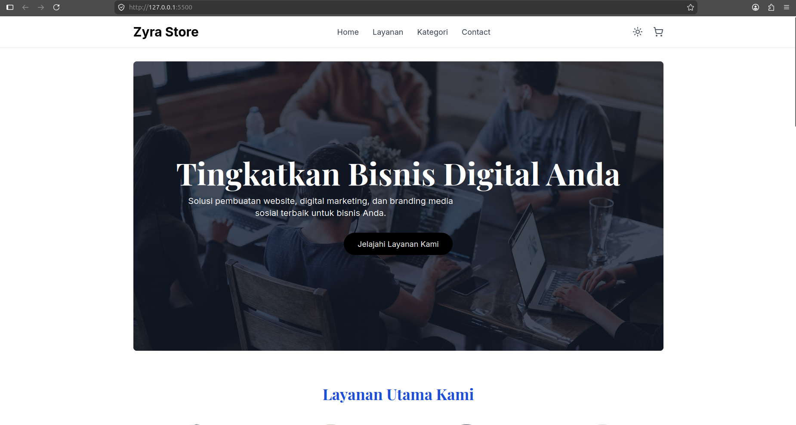
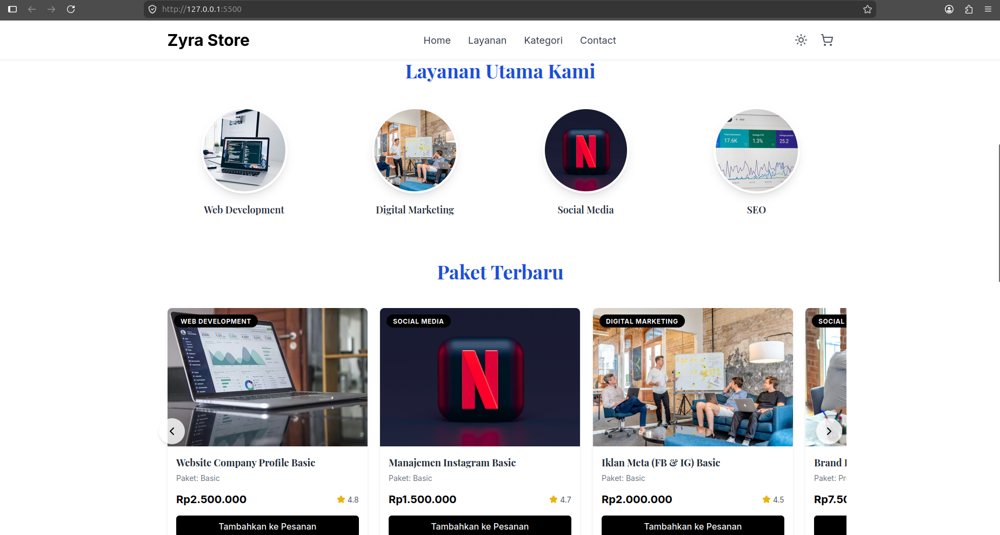
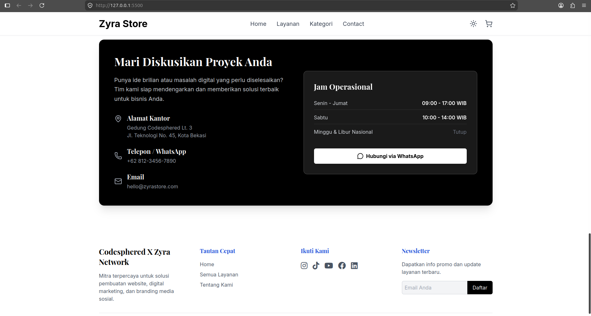

# Zyra Store - Digital Agency & E-Commerce Platform

Zyra Store adalah platform agensi digital berbasis web (Single Page Application simulasi) yang menawarkan berbagai layanan profesional seperti pembuatan website, digital marketing, optimasi SEO, dan manajemen media sosial. Website ini dirancang dengan antarmuka yang modern, responsif, dan elegan menggunakan tema monokrom (hitam putih).

## 🚀 Fitur Utama

- **Single Page Application (SPA) Experience**: Navigasi antar halaman (Katalog Layanan, Detail Layanan, Keranjang, Checkout) terasa mulus tanpa perlu memuat ulang seluruh halaman website.
- **Dark Mode (Mode Gelap)**: Terintegrasi dengan fitur beralih mode secara instan melalui tombol *toggle*, dirancang dengan paduan warna monokrom elegan.
- **Katalog Layanan Dinamis**: Menampilkan daftar paket layanan dengan fitur penyaringan (filter) berdasarkan kategori dan pengurutan (*sorting*) berdasarkan harga dan popularitas.
- **Sistem Keranjang (*Cart*)**: Pengguna dapat menambahkan layanan ke "Daftar Pesanan", menyesuaikan jumlah layanan, dan melihat total estimasi biaya sebelum masuk ke tahap *checkout*.
- **Validasi Form Checkout Ketat**: Memastikan data klien diisi dengan format yang benar (misalnya format email dan nomor WhatsApp khusus Indonesia) sebelum pesanan dapat dilanjutkan.
- **Smooth Scrolling & Navigation**: Menggulir layar antar *section* secara profesional dengan memperhitungkan jarak *header* agar informasi tidak tertutup.

## 🛠️ Teknologi yang Digunakan

Proyek ini dibangun tanpa *framework frontend* berat, murni menggunakan teknologi fundamental yang dikemas modern:
- **HTML5 & Vanilla JavaScript**: Struktur semantik modern dan logika *client-side* murni.
- **Tailwind CSS (via CDN)**: *Utility-first CSS framework* untuk mempercepat pengembangan desain responsif.
- **Lucide Icons & FontAwesome (via CDN)**: Koleksi ikon *user interface* yang minimalis serta logo media sosial (brand icons).
- **Google Fonts**: Menggunakan *font* Playfair Display dan Inter.

## 📂 Struktur Folder

```text
.
├── index.html   # File utama HTML yang menampung seluruh struktur halaman.
├── style.css    # Penyesuaian tema khusus (hitam putih) dan transisi animasi.
├── app.js       # Logika aplikasi (katalog layanan, keranjang, navigasi, filter).
└── README.md    # Dokumentasi proyek.
```

## ⚙️ Cara Menjalankan (*Setup / Installation*)

Karena aplikasi ini dibangun di atas *frontend* murni tanpa memerlukan *backend* server lokal (*Node.js*, *Python*, dsb.), cara menjalankannya sangat mudah:

1. **Unduh atau Clone** direktori ini ke dalam komputer Anda.
2. Cukup klik ganda (buka) file `index.html` menggunakan *web browser* modern pilihan Anda (Google Chrome, Firefox, Safari, Edge, dll).
3. Anda langsung bisa berinteraksi dengan website sepenuhnya. Pendaftaran ke server (*Backend/Database*) saat ini hanya berupa simulasi *pop-up*.

## 💡 Kustomisasi (*Development*)

Jika Anda ingin mengubah paket layanan yang ditawarkan:
Buka file `app.js` menggunakan *text editor* atau IDE Anda (seperti VS Code).
Cari variabel *array* bernama `products` di bagian paling atas. Anda bisa mengedit nama paket, harga, deskripsi fitur, serta mengganti URL gambar layanannya di dalam *array* tersebut secara langsung.

## Screenshot
*Berikut beberapa tampilan Zyra Store:*







---

*Hak Cipta &copy; 2026 Codesphered X Zyra Network.*
